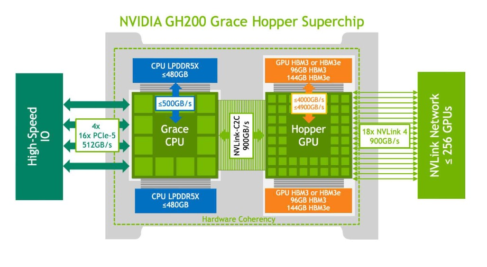

# Data Capture

wiyth the JUNGFRAU 9M the data capture and correction will be the single biggest challenges. The data are sent over 36 x 10Gb/s links, each carrying jumbo packets conforming to the SLS detector frame format (48 byte header followed by two rows of pixels from a 1024-pixel-wide module.) The SLS receiver software is used to capture these packets and reassemble data into the half module arrays, which are then (currently) written to disk (as a shared memory file system) in HDF5 though this is configurable.

The current set-up with the 1M on I24 allows data to be captured at 2000 frames per second, which with the overhead corresponds to 33.75Gb/s over a 4x10Gb/s link i.e. reasonably below the actual hard limit on the transfer. For the 9M we need to be able to carry nine times as much data, shared across 4 x 100GbE links, switched with the existing SN2100 switch. With overheads, and running at 2000 frames per second, each 100GbE link will need to sustain throughput of around 76Gb/s of useful traffic.

## SLS Detector Receiver

The SLS detector software includes a frame receiver which we used successfully on I24: one copy of the software is run for each data stream, with the receivers run on sequential ports on the the same IP address. In the 9M use case we will need to run sequences of 9 receivers on each of the 4 100GbE links, with all writing data to RAM continually at the line speed to prevent data loss. 

With the GH200 system the CPU to memory bandwidth is ~500GB/s giving sufficient headroom, however this needs to be shared with:

- reading the data out of RAM into the GPU
- reading the corrected data out of the GPU for compression
- compression and caching of the data before sending out

The incoming data stream is around 36GB/s indicating that there should be more than enough headroom but testing this is on the critical path.

## Implementation

Building the SLS detector software on ARM64 / linux is straightforward: it builds without errors however this needs to be exercised in anger. Without the detector this is going to be a substantial challenge.

At the moment the system has 1x Connect-X 7 network card offering 2 x 200GbE network sockets, however the switch is limited to 100GbE so we will need a second network card if we are to support the entire 9M in a single system. A second card is therefore going to be needed at a cost of around £4,000 (which seems excessive but corresponds to a quote from 2024-10-22).

## Testing

Testing the data capture for the 9M will present a huge challenge: generating the correctly formatted data streams will require some implementation work, and generating the full rate data streams will require work and also substantial hardware.

### Stage 0

Testing data capture against the existing 1M should be trivial, and will show that the software works correctly. This will not get close to stressing the system. Testing with the detector is however inefficient as it prevents the use of the detector for other purposes e.g. in the detector lab.

Testing the frame receiver against a synthetic data source corresponding to a 1M detector should be straightforward since we can use the exiting data capture computer on I24 (which is used with the real 1M JUNGFRAU) as a data source.

Task: [build detector simulator and test](https://github.com/graeme-winter/jungfrau/issues/30)

### Stage 1

Assuming we have some basic test of the capture system working we can plan for testing the full data capture system by moving the data capture computer to CS04R and repurposing 9 cluster nodes as data sources. N.B. until we have the second Connect-X 7 card we will at most be able to test the equivalent of half the detector, 18 half-module streams: with the second network card and the switch moved across we should be able to prove the entire system (N.B. including all of the correction steps, documented elsewhere.)

Task: build full detector simulator, even if this is just creating "blank" data, show it can be captured at line speed.

If we cannot create a synthetic test environment we will need to consider taking the data capture system to a working 9M detector for testing.

## Alternatives

Everything above is working towards the goal of capturing the data on the GH200 system. If this is impossible we need to fall back to the `jungfraujoch` system, with 4 x U55C FPGA cards.