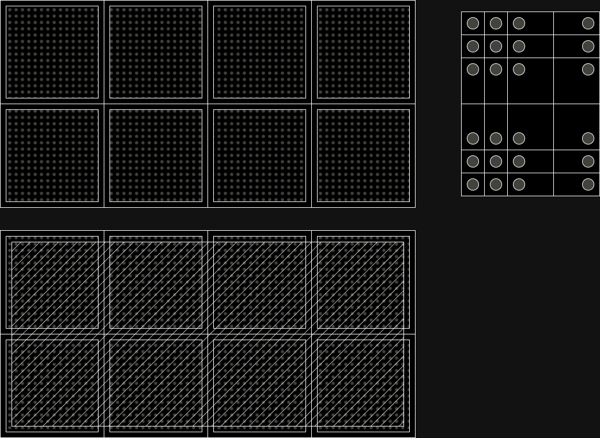

# Format

The data format needs to be sufficient to represent data with a saturation value typically around 10,000 counts - so 16 bits should be more than adequate. The values must also allow for masking i.e. recording a value for a pixel which indicates that the pixel value is untrusted, with the reason encoded in an external mask (which is assumed to be constant for the data set).

Since negative values are possible (if rare) the only logical option is to select a value which is unlikely to occur naturally, so for 16 bits `0x8000` i.e. 32,768 (unsigned) is selected: this value indicates that the pixel should be ignored.

## Detector Structure

The detector is made of modules, which are themselves assembled from ASICs of 256x256 pixels:



The bump bonds are every 75µm in each direction within the ASIC, but the chips do not pack so the pixels around the edge of every chip are either twice or four times the size as illustrated. Each full module is made from a single silicon crystal, so charge built up "between" the big pixels will accumulate at the nearest bump bonds: around the edge of the module the behaviour is less well defined, so the very edge pixels are usually excluded completely (which is the same for EIGER) whilst the inter-ASIC pixels can be estimated by sharing the counts accumulated _or_ can also be masked completely - however to maintain the geometry, even the masked pixels need to be masked to ensure that the invalid pixel gap is mainted as 4 pixels or 300µm. Alternatively each detector module could be described as being eight 254x254 pixel modules (excluding the big pixels) but this would incur substantial computational expense in the data analysis.

## Format on Disk

The primary data come in the form of 4 streams each consisting of 256x1024 pixel arrays. These include double sized pixels around the edge of every module which should be ignored, or doubled in one or two directions as needed if the data from those pixels are are [considered to be useful](https://github.com/graeme-winter/jungfrau/issues/19). The fundamental data size will therefore be 1024x256 if we are keeping the data the same shape as the readouts, or 1028x256 if we are doubling pixels and ignoring those at the edge of the module (masking optional.) N.B. for half-modules this will be vertically asymmetric, so be prepared for some apparent oddness.

If the data are masked then we can perform spot finding / initial analysis on half modules with no loss of fidelity. If we are keeping the big pixels, we will need to bring together the arrays from the top and bottom of each module to correctly interpret the data.

### Format vs. Time

The primary data stream consists of 36x UDP streams consisting of a [48 byte header](https://slsdetectorgroup.github.io/devdoc/udpheader.html) which identifies the module, position on module, frame number and row, followed by 4k pixels (8kB) of uncorrected data: this will be reassembled into half-module image arrays by the SLS detector software.

When the original data are captured we will have 36x ½ module streams, in some form, in memory. These need to be corrected if experimental data, or be used for pedestal evaluation if they are a pedestal run.

### Module Arrangement

Since the data come from 36 half modukes, belonging to 18 full modules, we need to decide on how they are mapped between module number in the instrument and the actual index =>

```
[[ 0 12 24]
 [ 1 13 25]
 [ 2 14 26]
 [ 3 15 27]
 [ 4 16 28]
 [ 5 17 29]
 [ 6 18 30]
 [ 7 19 31]
 [ 8 20 32]
 [ 9 21 33]
 [10 22 34]
 [11 23 35]]
 ```

 Treat them this way, so if we need to combine we combine `2 j` with `2 j + 1`.
 