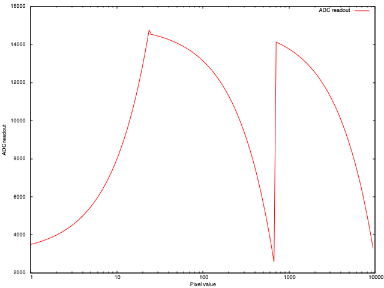

# Pixel Simulation

Generating the pixel data as if just collected from a JUNGFRAU, from an EIGER data set, is a multi-step process. The first is to construct the EIGER "readout" i.e. undo the virtual pixel correction, then reconstruct an appropriate ADC readout, before finally shaping the data into the form which would be captured by the SLS receiver software.

## Big Pixel Reconstruction

The pixels around the ASIC boundaries all have effectively doubled size, though the ones around the edge of the module are masked and lost completely. This gives rise to some complexity discussed [elsewhere](./BIG_PIXELS.md), which is equally the case for EIGER detectors. To faithfully reconstruct the "raw" data this process needs to be inverted here: in the initial case simply treating these data as masked will be adequate but in the longer game we will need to perform the arithmetic to get the pixels handled gracefully. This will be critical for testing the performance of the forward correction in the data capture and correction system.

## ADC Readout Reconstruction

The conversion from the ADC readout to pixels is performed in two stages: first the pedestal is subtracted from the readout (i.e. the no-illumination ADC readout) then the subtracted value converted to an estimate of the deposited charge, in keV, before converting to photons.

From [S. Redford et al 2018 JINST 13 C01027](https://iopscience.iop.org/article/10.1088/1748-0221/13/01/C01027/pdf) the values for the gains are approximately 40 for G0 mode, -1.5 for G1, -0.1 for G2, with pedestals around 3000, 15000, 15000 respectively. These can be used, along with the approximate photon limits of the gain modes (around 25, 700, reported in the same paper) to estimate the readout which could be expected for a given photon count. A toy model for this:

```python
import math

G0E = 40 * 12.4
G1E = -1.5 * 12.4
G2E = -0.1 * 12.4

P0 = 3000
P1 = 15000
P2 = 15000

for j in range(160):
    j = math.pow(10, 0.025 * j)
    j0, j1, j2 = j * G0E + P0, j * G1E + P1, j * G2E + P2
    if j < 25:
        print(j, j0)
    elif j < 700:
        print(j, j1)
    else:
        print(j, j2)
```

Gives useful output:



This can be used to help convert from "real" data from an Eiger to an estimate of the readout value, prefixed with the gain mode bits (0, 1, 3).

## On Disk Format

The data format captured by SLS detector results in a file for each module or half-module with a sequence of binary data blocks of 112 byte header (for half-modules) followed by the raw pixel readouts `[gain][ADC readout]` for the half module. The header contains the frame number, a time stamp and some other info e.g. the module position in the detector, as [documented here](https://slsdetectorgroup.github.io/devdoc/udpheader.html). This header is 48 bytes: the frame header in the file contains a further 64 bytes defining the status of the 64 pixel rows, since each half-module is made from 64 groups of four lines of pixels.

## Full System

[Implemented](../006-simulator-data-generator/data_generator.py) in a very slow Python script which could almost certainly be sped up by an order of magnitude or more by being more sensible, but generally appears to at least _look_ right. Be aware that the decompressed data streams are _huge_: 18MB / frame so ~54GB for a 3,600 image data set.
