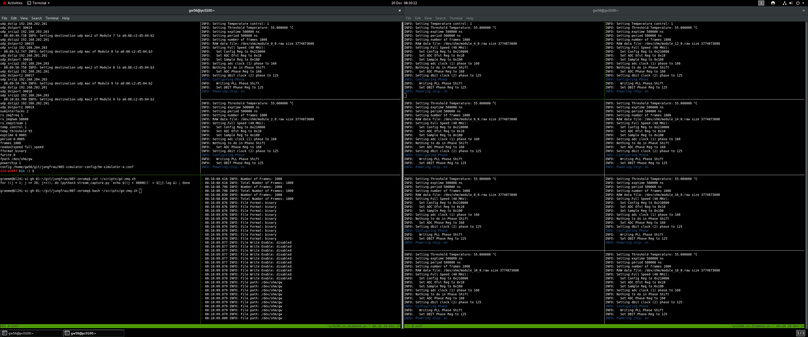

# Jungfrau Simulator

The [SLS detector software](https://slsdetectorgroup.github.io/devdoc/) includes simulators which can be used to simulate the behaviour of the detectors. These are available if you compile the code with `SLS_USE_SIMULATOR=ON` i.e.

```
git clone git@github.com:slsdetectorgroup/slsDetectorPackage.git
mkdir slsDetectorPackage-build
cd slsDetectorPackage-build
cmake -DCMAKE_INSTALL_PREFIX=${HOME}/sls -DSLS_USE_SIMULATOR=ON \
  ../slsDetectorPackage
make
```

The configuration should be very similar to the real detector: this includes pointers to the detector configuration, the frame receiver and the configuration of each end.

## Jungfrau Configuration

The running 1M configuration at the end of the last experiments was:

```
hostname i24-jf1md-00+i24-jf1md-01+

0:rx_tcpport 1954
1:rx_tcpport 1955

rx_hostname bl24i-sc-jcu01+bl24i-sc-jcu01+

0:udp_srcip 192.168.200.201
0:udp_dstip 192.168.200.200
0:udp_dstport 32410

0:udp_srcip2 192.168.200.202
0:udp_dstip2 192.168.200.200
0:udp_dstport2 32411

1:udp_srcip 192.168.200.203
1:udp_dstip 192.168.200.200
1:udp_dstport 42410

1:udp_srcip2 192.168.200.204
1:udp_dstip2 192.168.200.200
1:udp_dstport2 42411

numinterfaces 2

fwrite 0

rx_zmqfreq 1
rx_zmqhwm 50000
rx_zmqstream 1

temp_control 1
temp_threshold 55

exptime 0.01
frames 1
speed full_speed
```

This sets up the hostname to talk to over the 1Gb/s copper lines to control the detector, the machine where the frame receiver is running and the UDP configuration to talk over the fast links between the two. The simulation configuration should be similar to this, though the examples all use `localhost` for the hostname for simplicity.

## Simulator Configuration

Start with a trivial configuration, which has a single module (though with two channels configured) and everything hooked into loopback addresses on `127.0.0.1`:

```
hostname localhost+

0:rx_tcpport 1954

rx_hostname localhost+

0:udp_srcip 127.0.0.1
0:udp_dstip 127.0.0.1
0:udp_dstport 30001

0:udp_srcip2 127.0.0.1
0:udp_dstip2 127.0.0.1
0:udp_dstport2 30002

numinterfaces 2

fwrite 0

rx_zmqfreq 1
rx_zmqhwm 50000
rx_zmqstream 1

temp_control 1
temp_threshold 55

exptime 0.001
frames 1000
speed full_speed

fformat binary
fwrite 1
fpath /dev/shm/gw

powerchip 1
```

To use this you then need to start the jungfrau simulator:

```
./jungfrauDetectorServer_virtual
```

which will then listen to everything, start the frame receiver:

```
./slsReceiver
```

though maybe the "multi receiver" is what will be needed here, then finally use the sls control programs to send the configuration above, and start the acquisition:

```
./sls_detector_put config virtual_jf.config 
./sls_detector_acquire
```

N.B. this sets up a shared memory area which handles much of the state.

## Simulator Enhancements

Want to be able to read data in to the simulator to transmit, either generated from Eiger data by performing an "[inverse correction](./PIXEL_SIMULATION.md)" or data captured from a real JUNGFRAU data collection.

The simulator is built around simulating _modules_ i.e. one simulator tries to generate the data for one module of 512x1024 pixels. The construction of the header is pretty basic, and done in a tight loop, and (by default) different for every pixel which is very expensive and prevents the system from going at full speed. In addition, there are issues with the way that the delays are calculated.

Improvements proposed:

- produce the chunks on a cleaner clock i.e. compute the times when these should be emitted at the _start_ of the scan then for each frame, wait until that time has passed
- pre-compute data for emission, assuming enough memory is available. For one of the old com15 nodes we have ~40GB of memory free, which at 1MB / frame should allow for ~20k frames - looping this though is fine so really only need ~3600 frames or something then re-transmit
- pre-computing most of the header then just updating a single frame counter seems easy

Will work towards these in a branch of the slsDetector package. Done.

## Simulator Machines

We have:

- 4 x com15 node each with 2 x 40GbE
- 1 x JCU

to use for driving the simulation. Need to map IP addresses to module / ports =>

Machine:

|        | Column 0 | Column 1 | Column 2 |
|--------|----------|----------|----------|
| Row 0  |   JTU1   |   JTU2   |   JTU3   |
| Row 1  |   JTU1   |   JTU2   |   JTU3   |
| Row 2  |   JTU1   |   JCU    |   JTU4   |
| Row 3  |   JTU1   |   JCU    |   JTU4   |
| Row 4  |   JTU2   |   JTU3   |   JTU4   |
| Row 5  |   JTU2   |   JTU3   |   JTU4   |

This is the "ultimate" configuration once we have the second ConnextX-7 card in the machine. In the meantime we can simulate a 5M (10 module) detector using two JTU machines and the JCU.

Here the first two "JTU" entries are on one interface, the second two on the other interface, and the first of these on one port, the second on another port, so need to map all the ports and interfaces correctly to have this work _right_.

Machine network / IP address hard coding:

| Machine | Interface |   IP Addresss   |
|---------|-----------|-----------------|
| jcu01   | p5p2      | 192.168.203.200 |
| jtu-01  | p2p1      | 192.168.203.201 |
| jtu-01  | p2p2      | 192.168.204.201 |
| jtu-02  | p2p1      | 192.168.203.202 |
| jtu-02  | p2p2      | 192.168.204.202 |
| jtu-03  | p2p1      | 192.168.203.203 |
| jtu-03  | p2p2      | 192.168.204.203 |
| jtu-04  | p2p1      | 192.168.203.204 |
| jtu-05  | p2p2      | 192.168.204.204 |

N.B. be sure to enable jumbo frames on both ends i.e. `ifconfig <interface> mtu 9000` and ensure that the routing tables are all correctly configured. The Grace Hopper configuration needs to put the interfaces on the 201 and 202 subnets:

| Machine | Interface   |   IP Addresss   |
|---------|-------------|-----------------|
|  gh-01  | enp1s0f1np1 | 192.168.201.201 |
|  gh-01  | enp1s0f0np0 | 192.168.202.201 |

All on `/24` mask, with routing via .254 gateway between subnets to reflect the switch configuration which has four vlans.

## 5M Simulation

This needs a [long config file](../005-simulator-config/5m-simulator-a.conf) but works correctly at full speed. It depends on using a modified version of the virtual server hacked around [in a fork of the repo](https://github.com/graeme-winter/slsDetectorPackage/pull/1) which is set up to:

1. correctly bond the sending interfaces
2. correctly route the packets
3. hard clocked to send packets on the right timescales
4. reads raw data from pre-canned data files but rewrites the packet headers in flight

To execute the simulation will require a large number of terminals to connect to the various test machines for running the frame receivers and 10x jungfrau simulators:

1. ssh to bl24i-sc-jcu01, run two login sessions, each one full module of the simulation, run: `jungfrauDetectorServer_virtual -p PORT` where `PORT` is `2000` and `2010` for the first two modules
2. ssh into i24-jtu-01, run 4 login sessions, each will run one full module of the simulation - run as `jungfrauDetectorServer_virtual -p PORT` where `PORT` is 2020, 2030, 2040, 2050
3. ssh into i24-jtu-03, run 4 login sessions, each will run one full module of the simulation - run as `jungfrauDetectorServer_virtual -p PORT` where `PORT` is 2020, 2030, 2040, 2050
4. ssh into bl24i-sc-gh-01, run `sudo slsMultiReceiver 3000 10 0` - this will spin up 10 receivers

At this point the desktop may look like:



5. on an i24 machine run:

```
sls_detector_put config ~/git/jungfrau/005-simulator-config/5m-simulator-a.conf
```
This will produce a lot of output... you can then trigger acquisition with `sls_detector_acquire` which should work fine at 1000Hz (1.0 / (period + exptime)).

6. on bl24i-sc-gh-01 run 20 x "canary" zeroMQ receivers: these will just read the packets to load the system and then capture the time since first packet arrived:

```
cd git/jungfrau/007-zeromq
for ((j = 1; j <= 20; j++)); 
  do (python3 stream_capture.py `echo $((j + 30000))` > ${j}.x &) ; 
done
```

7. set up a more challenging test environment: exposure time / period set to 0.25ms (i.e. 2000Hz cycle) with `sls_detector_put exptime 0.00025` and `sls_detector_put period 0.00025` then set the acquisition to 1,000,000 frames with `sls_detector_put frames 1000000`. This is viewed as being a reasonable challenge, as it corresponds to ~ 8 minutes of full rate sample injector experiment.
8. go.

Mid way through things should look like this:


And at the end like this:


Key visible points:
1. the acquisition shows 10 x 2 x 1,000,000 frames acquired
2. the data were sent in 499.995s or so
3. mid-run the load on the system was reasonable, well inside the envelope (even allowing for an 80% increase to go from 10 to 18 modules)

The canaries were recording the timestamps which can be used to infer an overall delay:


Here we can see there _was_ a delay in the data arrival however this topped out at ~10s over 500s i.e. around 2% and no data were lost, and the system had plenty of capacity for further buffering. It seems likely that the delay was somewhat induced by the Python implementation of the zeroMQ so a C++ version should be developed (and will be needed in production anyway.)

## Simulation Conclusion

### Executive Summary

The 5M simulation shows that the Grace Hopper system has more than enough capability to capture data at full frame rate for a 5M. With a second ConnectX-7 card (around £2.5k) we should be able to run the full 9M capture into a single system.

### Effort Justification

The majority of the work here was needed to build a simulation infrastructure which will be used for any solution e.g. GPU / Grace Hopper or FPGA / JungfrauJoch. 1,000,000 frame simulation feels like a reasonable baseline: in reality this is unlikely to be performed since the fixed target system takes some measurable time to move from one position on the grid to the next, even if we are recording 100 images at every point.

### Decision Point

Do we proceed with the Grace Hopper system, or decide to use the JungfrauJoch? Factors:
- we have in house expertise in GPU programming
- this purely software solution is relatively simple and building on the SLS detector system
- this is not a proven system
- FPGA technology is ultimately better suited to the problem but comes with very large learning cost
- building our own solution allows us to incorporate customised data decimation / blank data veto

I advise that we proceed with the Grace Hopper work and invest in a second ConnectX-7 card. Meanwhile we should develop the live data correction / compression / analysis against the 5M simulator.

## Appendix: Canary

The canary is minimal deliberately:

```python
import json
import sys
import time

import zmq

host = "0.0.0.0"
port = int(sys.argv[1])

context = zmq.Context()
socket = context.socket(zmq.SUB)
socket.setsockopt(zmq.SUBSCRIBE, b"")
socket.setsockopt(zmq.RCVHWM, 50000)
socket.connect(f"tcp://{host}:{port}")

t0 = -1

while True:
    messages = socket.recv_multipart()
    if t0 < 0:
        t0 = time.time()
    header = json.loads(messages[0])
    if header["bitmode"] == 0:
        break
    n = header["frameIndex"] + 1
    if not n % 1000:
        print(n, time.time() - t0)
```

There are numerous ways that this could be improved.

## Appendix: Hacked SLS Detector

Currently located at: https://github.com/graeme-winter/slsDetectorPackage/pull/1
